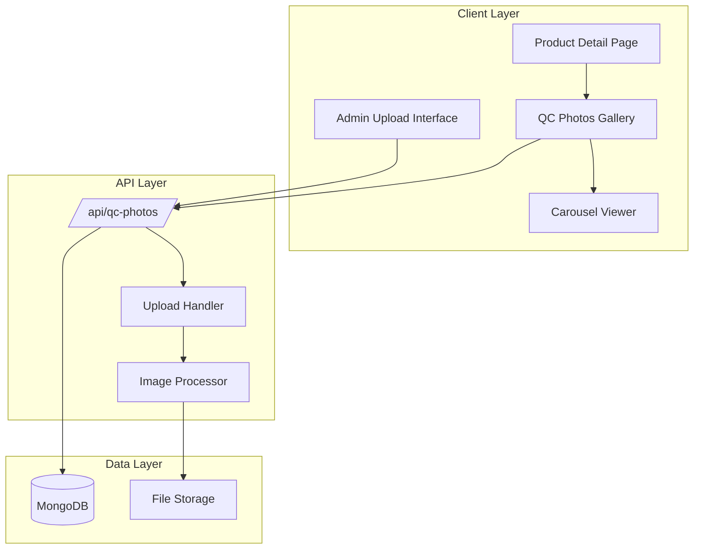
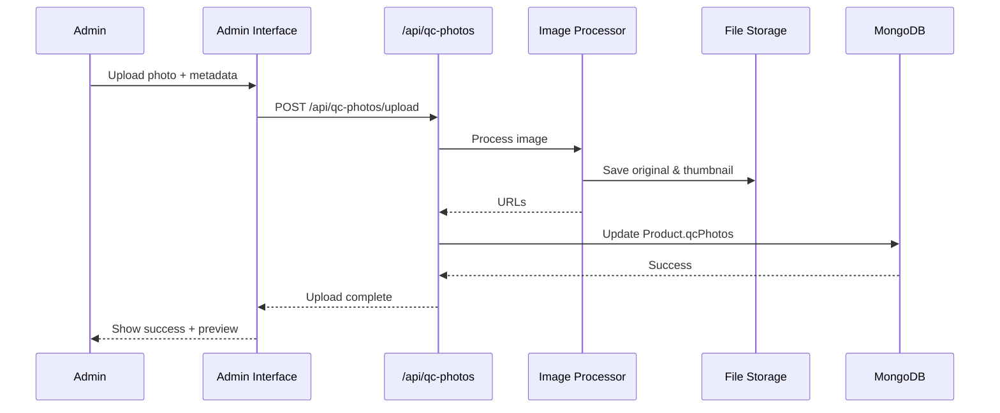

# Design Document: QC Photos Gallery

## Overview

The QC Photos Gallery feature adds sophisticated quality check photo management and display capabilities to product detail pages. The system enables administrators to upload, categorize, and organize QC photos by color variant, while customers can browse photos through an intuitive thumbnail gallery with category filtering and a full-screen carousel viewer with zoom capabilities.

This design integrates seamlessly with the existing Next.js application architecture, MongoDB database, and component patterns. The feature consists of:

1. **Frontend Components**: Gallery display, carousel viewer, admin upload interface
2. **Backend API**: Photo upload, retrieval, deletion, and reordering endpoints
3. **Database Schema**: Extended Product model with QC photo associations
4. **File Storage**: Integration with existing file storage infrastructure

### Key Technical Decisions

- **Storage Strategy**: Leverage existing MongoDB for metadata and use filesystem-based storage (public directory) or cloud storage (future enhancement) for actual image files
- **State Management**: React hooks and context for UI state, with server-side data fetching
- **Image Optimization**: Use Next.js Image component and Sharp library (already in dependencies) for automatic optimization
- **Component Architecture**: Reusable, composable components following existing patterns in the codebase
- **API Design**: RESTful endpoints following existing `/api/` structure

## Architecture

### System Architecture



### Component Hierarchy

```
ProductDetail
├── QCPhotosGallery
│   ├── CategoryFilter
│   ├── ThumbnailGrid
│   │   └── ThumbnailCard (multiple)
│   │       ├── PhotoCountBadge
│   │       └── ViewAllLink
│   └── CarouselViewer
│       ├── MainPhotoDisplay
│       │   └── ZoomControls
│       ├── NavigationControls
│       └── ThumbnailStrip
│
AdminUploadInterface (admin panel)
├── ProductSelector
├── VariantSelector
├── UploadZone
│   ├── DragDropHandler
│   └── FilePickerButton
├── PhotoManagementGrid
│   └── PhotoCard (multiple)
│       ├── CategoryDropdown
│       ├── DragHandle
│       └── DeleteButton
└── ProgressIndicator
```


## Components and Interfaces

### 1. QCPhotosGallery Component

**Purpose**: Main container component that displays QC photos organized by color variant with category filtering.

**Props**:
```typescript
interface QCPhotosGalleryProps {
  productId: string;
  colorVariants: ColorVariant[];
  qcPhotos: QCPhoto[];
}
```

**State Management**:
- `selectedCategory`: Currently active category filter
- `isCarouselOpen`: Carousel viewer visibility
- `selectedPhotoGroup`: Active photo group for carousel
- `selectedPhotoIndex`: Current photo index in carousel

**Key Responsibilities**:
- Group QC photos by color variant
- Handle category filtering logic
- Manage carousel modal state
- Render thumbnail grid
- Display total photo count

### 2. CategoryFilter Component

**Purpose**: Tab-based interface for filtering photos by category.

**Props**:
```typescript
interface CategoryFilterProps {
  categories: string[];
  selectedCategory: string;
  onCategoryChange: (category: string) => void;
  photoCounts: Record<string, number>;
}
```

**Features**:
- Always includes "All" tab
- Displays photo count per category
- Keyboard navigation support
- Active tab indication

### 3. ThumbnailCard Component

**Purpose**: Displays a preview of a photo group with metadata.

**Props**:
```typescript
interface ThumbnailCardProps {
  photoGroup: PhotoGroup;
  variantName: string;
  onClick: () => void;
}
```

**Displays**:
- First photo as thumbnail
- Color variant label
- Photo count badge (if >1 photo)
- "View all (N)" link (if ≥2 photos)

### 4. CarouselViewer Component

**Purpose**: Full-screen modal for viewing and navigating QC photos with zoom capability.

**Props**:
```typescript
interface CarouselViewerProps {
  isOpen: boolean;
  photos: QCPhoto[];
  initialIndex: number;
  onClose: () => void;
}
```

**State**:
- `currentIndex`: Current photo index
- `zoomLevel`: Current zoom percentage (100-300)
- `panPosition`: Pan offset for zoomed images

**Features**:
- Keyboard navigation (Arrow keys, Escape)
- Touch gestures (swipe, pinch-to-zoom)
- Previous/Next controls with boundary logic
- Thumbnail strip navigation
- Zoom controls with pan capability
- Focus trap when open


### 5. AdminUploadInterface Component

**Purpose**: Administrative interface for uploading and managing QC photos.

**Location**: `/src/app/admin-99x-hsd/products/[id]/qc-photos` (new page)

**Props**:
```typescript
interface AdminUploadInterfaceProps {
  productId: string;
}
```

**State**:
- `selectedVariant`: Currently selected color variant
- `uploadQueue`: Files waiting to be uploaded
- `uploadProgress`: Map of file names to upload progress
- `photos`: Current QC photos grouped by variant
- `dragActive`: Drag-and-drop active state

**Features**:
- Product and variant selection
- Drag-and-drop upload zone
- Click-to-upload file picker
- Photo reordering via drag-and-drop
- Category assignment dropdown
- Delete confirmation dialog
- Upload progress indicators
- Error message display

### 6. Supporting Types and Interfaces

```typescript
interface QCPhoto {
  _id: string;
  url: string;
  thumbnailUrl: string;
  variantId: string;
  variantName: string;
  category: PhotoCategory;
  order: number;
  uploadedAt: Date;
  altText: string;
}

interface PhotoGroup {
  variantId: string;
  variantName: string;
  photos: QCPhoto[];
}

interface ColorVariant {
  _id: string;
  name: string;
  productId: string;
  image?: string;
}

type PhotoCategory = 'All' | 'Overview' | 'Packaging' | 'Details';

interface UploadRequest {
  file: File;
  productId: string;
  variantId: string;
  category: PhotoCategory;
}

interface ReorderRequest {
  photoId: string;
  newOrder: number;
  variantId: string;
}
```


## Data Models

### Extended Product Schema

The existing `Product` model in `/src/models/Product.js` will be extended to include QC photo references:

```javascript
// Addition to existing ProductSchema
const ProductSchema = new mongoose.Schema({
  // ... existing fields ...
  
  qcPhotos: [{
    url: {
      type: String,
      required: true,
    },
    thumbnailUrl: {
      type: String,
      required: true,
    },
    variantId: {
      type: String,
      required: true,
      index: true,
    },
    variantName: {
      type: String,
      required: true,
    },
    category: {
      type: String,
      enum: ['Overview', 'Packaging', 'Details'],
      default: 'Overview',
      index: true,
    },
    order: {
      type: Number,
      default: 0,
    },
    altText: {
      type: String,
      default: '',
    },
    uploadedAt: {
      type: Date,
      default: Date.now,
    }
  }],
  
  // Index for efficient querying
}, {
  timestamps: true,
});

// Add compound index for efficient variant-based queries
ProductSchema.index({ '_id': 1, 'qcPhotos.variantId': 1 });
```

### Rationale for Embedded Array Structure

Instead of creating a separate `QCPhoto` collection, we embed QC photos directly in the Product document because:

1. **Query Efficiency**: QC photos are always queried in the context of a product
2. **Atomicity**: Updates to photos and products can be atomic
3. **Simplicity**: Reduces join operations and maintains data locality
4. **Existing Pattern**: The current schema uses embedded arrays (e.g., `qcImages`)

### Data Flow




## API Endpoints

### 1. Upload QC Photo

**Endpoint**: `POST /api/qc-photos/upload`

**Authentication**: Required (admin only)

**Request**:
- Content-Type: `multipart/form-data`
- Body:
  ```typescript
  {
    file: File,
    productId: string,
    variantId: string,
    variantName: string,
    category: PhotoCategory,
    altText?: string
  }
  ```

**Response**:
```typescript
{
  success: boolean,
  photo?: QCPhoto,
  error?: string
}
```

**Process**:
1. Validate authentication and authorization
2. Validate file type (JPEG, PNG, WEBP, GIF)
3. Validate file size (<10MB)
4. Generate unique filename using UUID
5. Process image with Sharp:
   - Optimize original (max 1920px width, quality 85%)
   - Generate thumbnail (300px width, quality 80%)
6. Save files to storage
7. Calculate next order value for variant
8. Update Product document with new qcPhotos entry
9. Return photo metadata

### 2. Get QC Photos for Product

**Endpoint**: `GET /api/qc-photos?productId={id}&variantId={variantId}`

**Authentication**: Not required (public)

**Query Parameters**:
- `productId` (required): Product ID
- `variantId` (optional): Filter by specific variant
- `category` (optional): Filter by category

**Response**:
```typescript
{
  success: boolean,
  photos: QCPhoto[],
  variants: { variantId: string, variantName: string, count: number }[]
}
```

### 3. Delete QC Photo

**Endpoint**: `DELETE /api/qc-photos/:photoId`

**Authentication**: Required (admin only)

**Request Body**:
```typescript
{
  productId: string
}
```

**Response**:
```typescript
{
  success: boolean,
  message: string
}
```

**Process**:
1. Validate authentication
2. Find Product and photo entry
3. Delete files from storage (original + thumbnail)
4. Remove photo entry from Product.qcPhotos array
5. Reorder remaining photos in variant to maintain sequence
6. Return success


### 4. Reorder QC Photos

**Endpoint**: `PATCH /api/qc-photos/reorder`

**Authentication**: Required (admin only)

**Request Body**:
```typescript
{
  productId: string,
  variantId: string,
  photoOrders: { photoId: string, order: number }[]
}
```

**Response**:
```typescript
{
  success: boolean,
  message: string
}
```

**Process**:
1. Validate authentication
2. Find Product document
3. Update order field for each photo in the variant
4. Save Product document
5. Return success

### 5. Update QC Photo Metadata

**Endpoint**: `PATCH /api/qc-photos/:photoId`

**Authentication**: Required (admin only)

**Request Body**:
```typescript
{
  productId: string,
  category?: PhotoCategory,
  altText?: string
}
```

**Response**:
```typescript
{
  success: boolean,
  photo: QCPhoto
}
```

### API Error Handling

All endpoints follow consistent error response format:

```typescript
{
  success: false,
  error: string,
  code?: 'INVALID_FILE_TYPE' | 'FILE_TOO_LARGE' | 'UNAUTHORIZED' | 'NOT_FOUND' | 'UPLOAD_FAILED'
}
```

**HTTP Status Codes**:
- 200: Success
- 400: Bad request (validation error)
- 401: Unauthorized
- 403: Forbidden (not admin)
- 404: Resource not found
- 413: Payload too large
- 500: Server error


## File Storage Strategy

### Storage Location

**Development/Initial Implementation**: Filesystem-based storage in `/public/qc-photos/`

```
/public/qc-photos/
  /{productId}/
    /{variantId}/
      /original/
        {uuid}.jpg
      /thumbnails/
        {uuid}.jpg
```

**Future Enhancement**: Cloud storage (AWS S3, Cloudflare R2, or Supabase Storage)

### Image Processing Pipeline

Using Sharp (already in dependencies):

```javascript
// Original image processing
await sharp(buffer)
  .resize(1920, null, { 
    fit: 'inside',
    withoutEnlargement: true 
  })
  .jpeg({ quality: 85, progressive: true })
  .toFile(originalPath);

// Thumbnail generation
await sharp(buffer)
  .resize(300, 300, { 
    fit: 'cover',
    position: 'center' 
  })
  .jpeg({ quality: 80 })
  .toFile(thumbnailPath);
```

### File Naming Convention

- Format: `{timestamp}-{uuid}.{ext}`
- Example: `1734567890123-a1b2c3d4-e5f6.jpg`
- Ensures uniqueness and sortability

### Storage Considerations

1. **Backup Strategy**: Regular backups of `/public/qc-photos/` directory
2. **CDN Integration**: Serve images through CDN in production
3. **Cleanup**: Orphaned file detection and removal (photos without DB entries)
4. **Migration Path**: Design API to abstract storage location for easy migration to cloud

### Security

1. **File Type Validation**: MIME type checking and magic number verification
2. **File Size Limits**: 10MB maximum to prevent abuse
3. **Filename Sanitization**: UUID-based naming prevents path traversal
4. **Access Control**: Admin-only upload, public read access


## State Management

### Client-Side State Architecture

The application will use React hooks for local component state and rely on server-side fetching for data synchronization.

**Gallery State** (QCPhotosGallery component):
```javascript
const [selectedCategory, setSelectedCategory] = useState('All');
const [isCarouselOpen, setIsCarouselOpen] = useState(false);
const [carouselData, setCarouselData] = useState(null);
```

**Carousel State** (CarouselViewer component):
```javascript
const [currentIndex, setCurrentIndex] = useState(0);
const [zoomLevel, setZoomLevel] = useState(100);
const [panPosition, setPanPosition] = useState({ x: 0, y: 0 });
```

**Admin State** (AdminUploadInterface component):
```javascript
const [selectedVariant, setSelectedVariant] = useState(null);
const [photos, setPhotos] = useState([]);
const [uploadQueue, setUploadQueue] = useState([]);
const [uploadProgress, setUploadProgress] = useState(new Map());
const [dragActive, setDragActive] = useState(false);
const [errors, setErrors] = useState([]);
```

### Data Fetching Strategy

**Product Detail Page**:
- Server-side fetch QC photos during initial page load
- Pass as props to QCPhotosGallery component
- Eliminates loading state for better UX

**Admin Interface**:
- Client-side fetch on component mount
- Optimistic updates for reordering
- Immediate UI feedback with background sync

### State Update Patterns

**Photo Upload**:
1. Add file to uploadQueue (immediate)
2. Show progress indicator (immediate)
3. Call upload API (async)
4. Update photos array on success (immediate)
5. Remove from uploadQueue (immediate)

**Photo Deletion**:
1. Show confirmation dialog
2. Optimistically remove from UI
3. Call delete API
4. Revert on error, show error message

**Photo Reordering**:
1. Update local order immediately (drag end)
2. Call reorder API in background
3. Revert on error (rare)


## Responsive Design Strategy

### Breakpoint System

Following existing patterns in the codebase:

```css
/* Mobile First Approach */
.qcGallery {
  /* Base styles for mobile */
}

/* Tablet */
@media (min-width: 768px) {
  .qcGallery {
    /* Tablet styles */
  }
}

/* Desktop */
@media (min-width: 1024px) {
  .qcGallery {
    /* Desktop styles */
  }
}

/* Large Desktop */
@media (min-width: 1440px) {
  .qcGallery {
    /* Large desktop styles */
  }
}
```

### Grid Layouts

**Thumbnail Grid**:
- Mobile (<768px): 2 columns, gap 12px
- Tablet (768-1024px): 3 columns, gap 16px
- Desktop (>1024px): 4 columns, gap 20px

**Carousel Viewer**:
- Mobile: Full screen, single photo with swipe navigation
- Tablet: Full screen with visible thumbnails strip at bottom
- Desktop: Full screen with prominent controls and thumbnail strip

### Touch Interactions

**Mobile Gestures**:
- Swipe left/right: Navigate photos in carousel
- Pinch-to-zoom: Zoom in/out on photos
- Double-tap: Toggle zoom (100% ↔ 200%)
- Drag: Pan zoomed image

**Desktop Interactions**:
- Mouse wheel: Zoom in/out
- Click and drag: Pan zoomed image
- Arrow keys: Navigate photos
- +/- buttons: Zoom controls

### Performance Optimizations

1. **Lazy Loading**: Load images as they enter viewport
2. **Progressive Images**: Show thumbnail while full image loads
3. **Responsive Images**: Serve appropriate sizes based on viewport
4. **CSS Grid**: Use CSS Grid for efficient layouts
5. **Touch Event Optimization**: Passive event listeners for scroll performance


## Correctness Properties

*A property is a characteristic or behavior that should hold true across all valid executions of a system—essentially, a formal statement about what the system should do. Properties serve as the bridge between human-readable specifications and machine-verifiable correctness guarantees.*

### Property Reflection

After analyzing the acceptance criteria, several properties were identified. The following reflection eliminates redundancies:

**Consolidations Made**:
1. Properties 1.1 and 6.4 (grouping by variant) are identical - consolidated into Property 1
2. Properties 8.1 and 8.4 (display order matches stored order) are identical - consolidated into Property 5
3. Properties 9.2 and 10.4 (upload processing) are identical - consolidated into Property 7
4. Properties 9.3, 12.1, and 12.3 (file type validation) are redundant - consolidated into Property 8
5. Property 2.1 (first photo as thumbnail) is subsumed by Property 2 (thumbnail and badge logic)

**Unique Properties Retained**:
- Photo grouping by variant (1.1, 6.4)
- Photo counting and display logic (2.1, 2.2, 2.5, 18.1)
- Category filtering (1.3, 3.3)
- Ordering preservation (8.1, 8.3, 8.4, 8.5)
- Upload and validation (6.3, 7.3, 9.2, 12.1-12.5)
- Uniqueness guarantees (15.1)

### Property 1: Photo Grouping by Color Variant

*For any* product with QC photos across multiple color variants, organizing the photos SHALL result in separate photo groups where each group contains only photos from a single variant, and all photos from each variant appear in exactly one group.

**Validates: Requirements 1.1, 6.4**

### Property 2: Thumbnail Display and Photo Counting

*For any* photo group, the thumbnail card SHALL display the first photo in the group's order sequence, and if the group contains N photos where N > 1, the badge SHALL display "+{N-1}"; if N = 1, no badge SHALL be displayed.

**Validates: Requirements 2.1, 2.2, 2.3**

### Property 3: Total Photo Count Accuracy

*For any* product with QC photos distributed across multiple photo groups, the displayed total count SHALL equal the sum of photo counts across all groups.

**Validates: Requirements 2.5**

### Property 4: Category Filtering Correctness

*For any* selected category and any set of QC photos with category assignments, the filtered result SHALL contain only photos that match the selected category, or all photos if the category is "All".

**Validates: Requirements 1.3, 3.3**


### Property 5: Photo Order Preservation

*For any* photo group with a configured display order, the photos SHALL be displayed in exactly the order specified by their order field values (ascending), regardless of upload time or other metadata.

**Validates: Requirements 8.1, 8.4**

### Property 6: Order Persistence After Reordering

*For any* valid reordering operation on a photo group, retrieving the photos after the reorder SHALL return photos in the newly specified order.

**Validates: Requirements 8.3**

### Property 7: Sequential Insertion Ordering

*For any* existing photo sequence for a color variant, adding new photos SHALL result in the new photos appearing after all existing photos, with order values greater than the maximum existing order value.

**Validates: Requirements 8.5**

### Property 8: Multi-File Upload Processing

*For any* set of valid image files uploaded simultaneously to a single color variant, all files SHALL be processed and stored, with each receiving a unique identifier and correct variant association.

**Validates: Requirements 6.3, 9.2, 9.4, 10.4**

### Property 9: File Type Validation

*For any* file submitted for upload, the system SHALL accept the file if and only if its MIME type is one of image/jpeg, image/png, image/webp, or image/gif.

**Validates: Requirements 9.3, 12.1, 12.3**

### Property 10: File Size Validation

*For any* file submitted for upload, if the file size exceeds 10MB, the upload SHALL be rejected with an appropriate error message; if the file size is 10MB or less and the file type is valid, the upload SHALL proceed.

**Validates: Requirements 12.2**

### Property 11: Category Assignment Persistence

*For any* QC photo and any valid category value, assigning the category to the photo SHALL result in the category being retrievable with that photo in subsequent queries.

**Validates: Requirements 7.3**

### Property 12: Unique Photo Identifiers

*For any* set of photos uploaded to the system, no two photos SHALL have the same identifier, regardless of upload time, product, variant, or any other metadata.

**Validates: Requirements 15.1**


### Property 13: Thumbnail Generation

*For any* valid image file successfully uploaded, the system SHALL generate a thumbnail version with maximum dimensions of 300x300 pixels.

**Validates: Requirements 15.4**

### Property 14: Carousel Thumbnail Strip Completeness

*For any* photo group displayed in the carousel viewer, the thumbnail strip SHALL contain exactly one thumbnail for each photo in the group, in the same order as the main display sequence.

**Validates: Requirements 4.6**

### Property 15: Zoom Level Reset on Navigation

*For any* carousel viewer state where the zoom level is not 100%, navigating to a different photo SHALL reset the zoom level to 100%.

**Validates: Requirements 5.5**

### Property 16: View All Link Visibility

*For any* photo group, the "View all (N)" link SHALL be visible if and only if the group contains 2 or more photos, and N SHALL equal the total photo count in the group.

**Validates: Requirements 18.1, 18.3**

### Property 17: Error Message Specificity

*For any* upload validation failure (invalid type, size exceeded, integrity check failed), the system SHALL return an error message that specifically indicates which validation rule failed.

**Validates: Requirements 12.5, 17.1, 17.2, 17.3, 17.5**

### Property 18: Variant Filtering Exclusivity

*For any* product with QC photos across multiple variants, when displaying photos for a specific variant, the result SHALL contain only photos associated with that variant and SHALL contain all photos associated with that variant.

**Validates: Requirements 1.1, 1.3**


## Error Handling

### Client-Side Error Handling

**Upload Errors**:
```typescript
interface UploadError {
  file: string;
  error: string;
  code: ErrorCode;
  recoverable: boolean;
}
```

**Error Display Strategy**:
1. **Toast Notifications**: For transient errors (network issues, timeouts)
2. **Inline Errors**: For validation errors (file type, size)
3. **Error List**: For batch upload failures (show which files failed)
4. **Retry Mechanism**: For recoverable errors with exponential backoff

**Example Error Handling**:
```javascript
try {
  const result = await uploadPhoto(file, metadata);
  if (!result.success) {
    throw new Error(result.error);
  }
  showSuccess('Photo uploaded successfully');
} catch (error) {
  if (error.code === 'NETWORK_ERROR') {
    // Show retry button
    setError({ 
      message: 'Upload failed. Check connection.', 
      recoverable: true 
    });
  } else if (error.code === 'INVALID_FILE_TYPE') {
    // Show inline error, no retry
    setError({ 
      message: 'Only image files allowed', 
      recoverable: false 
    });
  } else {
    // Generic error with retry
    setError({ 
      message: 'Upload failed. Please try again.', 
      recoverable: true 
    });
  }
}
```

### Server-Side Error Handling

**Upload Pipeline Errors**:
1. **File Type Validation**: Return 400 with specific error
2. **File Size Validation**: Return 413 with size limit message
3. **Image Processing Errors**: Return 500 with generic error (log details server-side)
4. **Storage Errors**: Attempt cleanup, return 500
5. **Database Errors**: Rollback storage operation, return 500

**Error Response Format**:
```javascript
{
  success: false,
  error: "User-friendly error message",
  code: "MACHINE_READABLE_CODE",
  details: {} // Only in development mode
}
```

### Retry Logic

**Client-Side Retry Strategy**:
- Network errors: 3 retries with exponential backoff (1s, 2s, 4s)
- Server errors (5xx): 2 retries with exponential backoff
- Client errors (4xx): No automatic retry (requires user action)

**Upload Timeout**:
- Set timeout to 30 seconds per file
- Show timeout error with retry option
- Log timeout events for monitoring


### Graceful Degradation

**Missing Photos**:
- Display placeholder image if photo URL returns 404
- Log missing photo for cleanup investigation
- Don't break gallery rendering

**API Failures**:
- Show cached data if available
- Display "Unable to load photos" message
- Provide refresh button

**Browser Compatibility**:
- Detect drag-and-drop support, fallback to file picker
- Detect WebP support, fallback to JPEG
- Detect touch support, adjust controls accordingly

## Testing Strategy

### Dual Testing Approach

The QC Photos Gallery feature requires comprehensive testing using both property-based tests and example-based tests:

**Property-Based Tests**: Verify universal properties across randomized inputs
- Used for: Data transformations, validation logic, ordering, filtering, grouping
- Tools: fast-check (JavaScript property-based testing library)
- Configuration: Minimum 100 iterations per property test

**Example-Based Tests**: Verify specific scenarios and edge cases
- Used for: UI interactions, specific workflows, integration points
- Tools: Jest + React Testing Library
- Coverage: UI component behavior, API integration, user workflows

### Property-Based Testing Strategy

**Test Library**: fast-check (https://github.com/dubzzz/fast-check)

Installation:
```bash
npm install --save-dev fast-check
```

**Property Test Configuration**:
```javascript
// Each property test MUST run minimum 100 iterations
fc.assert(
  fc.property(
    /* generators */,
    (/* inputs */) => {
      // Property assertion
    }
  ),
  { numRuns: 100 } // Minimum due to randomization
);
```

**Test Tag Format**:
All property tests MUST include a comment tag referencing the design property:
```javascript
/**
 * Feature: qc-photos-gallery
 * Property 1: Photo Grouping by Color Variant
 * 
 * For any product with QC photos across multiple color variants,
 * organizing the photos SHALL result in separate photo groups where
 * each group contains only photos from a single variant.
 */
test('photos are correctly grouped by variant', () => {
  fc.assert(/* ... */, { numRuns: 100 });
});
```


### Property Test Generators

Custom generators for domain objects:

```javascript
// Generator for QC Photo objects
const qcPhotoArb = fc.record({
  _id: fc.uuid(),
  url: fc.webUrl(),
  thumbnailUrl: fc.webUrl(),
  variantId: fc.uuid(),
  variantName: fc.string({ minLength: 1, maxLength: 20 }),
  category: fc.constantFrom('Overview', 'Packaging', 'Details'),
  order: fc.nat(100),
  uploadedAt: fc.date(),
  altText: fc.string()
});

// Generator for Photo Groups
const photoGroupArb = fc.record({
  variantId: fc.uuid(),
  variantName: fc.string({ minLength: 1, maxLength: 20 }),
  photos: fc.array(qcPhotoArb, { minLength: 1, maxLength: 20 })
});

// Generator for file types
const validImageTypeArb = fc.constantFrom(
  'image/jpeg', 'image/png', 'image/webp', 'image/gif'
);

const invalidFileTypeArb = fc.constantFrom(
  'application/pdf', 'text/plain', 'video/mp4', 'application/zip'
);
```

### Unit Test Coverage

**Component Tests** (React Testing Library):
1. QCPhotosGallery renders with empty state
2. QCPhotosGallery displays correct photo count
3. CategoryFilter switches active tab
4. ThumbnailCard displays badge when appropriate
5. CarouselViewer opens and closes correctly
6. CarouselViewer keyboard navigation works
7. AdminUploadInterface shows file picker on click
8. AdminUploadInterface shows drag-over state

**API Route Tests** (Jest):
1. Upload endpoint validates authentication
2. Upload endpoint rejects invalid file types
3. Upload endpoint rejects oversized files
4. Upload endpoint returns correct response format
5. Delete endpoint removes photo and cleans up files
6. Reorder endpoint updates order correctly
7. Get endpoint filters by variant and category

**Utility Function Tests**:
1. groupPhotosByVariant groups correctly
2. filterPhotosByCategory filters correctly
3. calculatePhotoOrder returns sequential values
4. generateUniqueFilename creates unique names
5. validateImageFile detects invalid types


### Integration Tests

**End-to-End Workflows**:
1. Complete photo upload flow (admin uploads photo, customer views it)
2. Photo reordering persists and displays correctly
3. Category filtering updates gallery display
4. Carousel navigation through photo group
5. Photo deletion removes from database and storage
6. Multi-file upload processes all files

**Performance Tests**:
1. Gallery loads within 1 second with 50 photos
2. Carousel transition completes within 400ms
3. Upload progress updates smoothly
4. Category filter responds within 300ms

**Accessibility Tests**:
1. All interactive elements are keyboard accessible
2. Focus trap works in carousel modal
3. Screen reader announcements are appropriate
4. ARIA labels are present and correct
5. Focus returns to trigger element on modal close

### Test Data Setup

**Mock Data Factory**:
```javascript
const createMockProduct = (overrides = {}) => ({
  _id: 'mock-product-id',
  name: 'Test Product',
  qcPhotos: [],
  ...overrides
});

const createMockQCPhoto = (overrides = {}) => ({
  _id: 'mock-photo-id',
  url: '/qc-photos/test.jpg',
  thumbnailUrl: '/qc-photos/test-thumb.jpg',
  variantId: 'mock-variant-id',
  variantName: 'Black',
  category: 'Overview',
  order: 0,
  uploadedAt: new Date(),
  altText: 'Test photo',
  ...overrides
});
```

### Testing Pyramid

```
         /\
        /  \    E2E Tests (5%)
       /____\   - Critical user journeys
      /      \  
     /        \ Integration Tests (15%)
    /__________\ - API + DB + Storage
   /            \
  /              \ Unit Tests (80%)
 /________________\ - Components, Utils, Logic
```

**Test Execution Strategy**:
- Unit tests: Run on every commit (fast, <5s)
- Integration tests: Run on PR creation (moderate, <30s)
- E2E tests: Run before deployment (slow, <2min)
- Property tests: Run in CI pipeline (100+ iterations)


## Implementation Notes

### Integration with Existing Codebase

**ProductDetail Component Integration**:

The QCPhotosGallery will be added to the existing ProductDetail component structure:

```javascript
// In ProductDetail.jsx
import QCPhotosGallery from '@/components/QCPhotosGallery';

export default function ProductDetail({ productId, initialData = null }) {
  // ... existing code ...
  
  return (
    <div className={styles.productDetailPageWrapper}>
      {/* ... existing content ... */}
      
      {/* Add QC Photos Gallery after main product info */}
      {productDetails?.qcPhotos?.length > 0 && (
        <QCPhotosGallery
          productId={productDetails.product._id}
          colorVariants={productDetails.colors}
          qcPhotos={productDetails.qcPhotos}
        />
      )}
    </div>
  );
}
```

**API Route Structure**:

Following existing patterns in `/src/app/api/`:

```
/src/app/api/qc-photos/
  ├── upload/
  │   └── route.js          # POST handler
  ├── [photoId]/
  │   └── route.js          # GET, PATCH, DELETE handlers
  ├── reorder/
  │   └── route.js          # PATCH handler
  └── route.js              # GET (list/filter)
```

**Authentication Integration**:

Use existing auth system from `@/context/AuthContext`:

```javascript
import { useAuth } from '@/context/AuthContext';

export default function AdminUploadInterface() {
  const { user, fetchWithAuth } = useAuth();
  
  // Check admin role
  if (!user || !user.isAdmin) {
    return <AccessDenied />;
  }
  
  // Use fetchWithAuth for authenticated requests
  const uploadPhoto = async (formData) => {
    const response = await fetchWithAuth('/api/qc-photos/upload', {
      method: 'POST',
      body: formData
    });
    return response.json();
  };
}
```

### Database Migration

**Adding qcPhotos field to existing products**:

```javascript
// Migration script: migrate-add-qc-photos.js
import mongoose from 'mongoose';
import Product from '@/models/Product';

async function migrate() {
  await mongoose.connect(process.env.MONGODB_URI);
  
  // Add empty qcPhotos array to all existing products
  await Product.updateMany(
    { qcPhotos: { $exists: false } },
    { $set: { qcPhotos: [] } }
  );
  
  console.log('Migration complete');
  await mongoose.disconnect();
}

migrate();
```


### Styling Strategy

**CSS Modules**: Follow existing pattern with dedicated module file

Create `/src/styles/QCPhotosGallery.module.css`:

```css
/* Gallery Container */
.qcGalleryContainer {
  margin-top: 40px;
  padding: 0 20px;
}

.qcGalleryHeader {
  display: flex;
  justify-content: space-between;
  align-items: center;
  margin-bottom: 20px;
}

.photoCount {
  font-size: 18px;
  font-weight: 600;
  color: var(--text-primary);
}

/* Category Filter */
.categoryFilter {
  display: flex;
  gap: 8px;
  overflow-x: auto;
  padding-bottom: 10px;
  scrollbar-width: thin;
}

.categoryTab {
  padding: 8px 16px;
  border: 1px solid var(--border-color);
  border-radius: 20px;
  background: transparent;
  cursor: pointer;
  transition: all 0.2s;
  white-space: nowrap;
}

.categoryTab:hover {
  border-color: var(--primary-color);
}

.categoryTab.active {
  background: var(--primary-color);
  color: white;
  border-color: var(--primary-color);
}

/* Thumbnail Grid */
.thumbnailGrid {
  display: grid;
  grid-template-columns: repeat(2, 1fr);
  gap: 12px;
  margin-top: 20px;
}

@media (min-width: 768px) {
  .thumbnailGrid {
    grid-template-columns: repeat(3, 1fr);
    gap: 16px;
  }
}

@media (min-width: 1024px) {
  .thumbnailGrid {
    grid-template-columns: repeat(4, 1fr);
    gap: 20px;
  }
}
```

**Design Tokens**: Use existing CSS variables from globals.css

```css
:root {
  --primary-color: #3b82f6;
  --text-primary: #1f2937;
  --border-color: #e5e7eb;
  --background: #ffffff;
  --shadow-sm: 0 1px 2px rgba(0, 0, 0, 0.05);
  --shadow-md: 0 4px 6px rgba(0, 0, 0, 0.1);
}
```


### Performance Optimization Strategy

**Image Loading**:
1. Use Next.js Image component for automatic optimization
2. Implement lazy loading with Intersection Observer
3. Load thumbnails first, full images on demand
4. Use WebP format with JPEG fallback

```javascript
import Image from 'next/image';

<Image
  src={photo.thumbnailUrl}
  alt={photo.altText}
  width={300}
  height={300}
  loading="lazy"
  placeholder="blur"
  blurDataURL={generateBlurDataURL(photo.thumbnailUrl)}
/>
```

**Bundle Size Optimization**:
1. Dynamic import for CarouselViewer (modal only loads when needed)
2. Code splitting for admin interface
3. Tree-shake unused dependencies

```javascript
// Dynamic import for carousel
const CarouselViewer = dynamic(() => import('./CarouselViewer'), {
  ssr: false,
  loading: () => <LoadingSpinner />
});
```

**Caching Strategy**:
1. Client-side: Cache photo URLs in memory during session
2. Server-side: Set Cache-Control headers for images (1 week)
3. API: Use stale-while-revalidate for photo lists

**Database Query Optimization**:
1. Index on `_id` and `qcPhotos.variantId` for fast filtering
2. Project only needed fields in API responses
3. Batch operations where possible

```javascript
// Efficient query with projection
const product = await Product.findById(productId)
  .select('qcPhotos name')
  .lean(); // Convert to plain JS object for better performance
```

### Accessibility Implementation

**Keyboard Navigation**:
- Gallery: Tab through thumbnail cards, Enter to open carousel
- Carousel: Arrow keys for navigation, Escape to close, Tab to thumbnail strip
- Admin: Tab through all controls, drag-and-drop with keyboard alternative

**ARIA Attributes**:
```jsx
<div 
  role="region" 
  aria-label="QC Photos Gallery"
  aria-describedby="qc-gallery-description"
>
  <p id="qc-gallery-description" className="sr-only">
    Gallery of quality check photos organized by color variant
  </p>
  
  <button
    role="tab"
    aria-selected={isActive}
    aria-controls="photo-panel"
    onClick={handleCategoryChange}
  >
    {category}
  </button>
</div>
```

**Focus Management**:
```javascript
// CarouselViewer focus trap
useEffect(() => {
  if (isOpen) {
    const firstFocusable = carouselRef.current.querySelector('button');
    firstFocusable?.focus();
    
    // Store previously focused element
    const previouslyFocused = document.activeElement;
    
    return () => {
      // Return focus on close
      previouslyFocused?.focus();
    };
  }
}, [isOpen]);
```

**Screen Reader Announcements**:
```jsx
<div role="status" aria-live="polite" className="sr-only">
  {uploadProgress.size > 0 && 
    `Uploading ${uploadProgress.size} files`
  }
  {uploadComplete && 
    `Upload complete. ${newPhotos.length} photos added.`
  }
</div>
```


## Security Considerations

### Upload Security

**File Type Validation**:
```javascript
// Validate MIME type AND magic numbers
import { fromBuffer } from 'file-type';

async function validateImageFile(buffer) {
  // Check magic numbers (first bytes of file)
  const fileType = await fromBuffer(buffer);
  
  const allowedTypes = ['image/jpeg', 'image/png', 'image/webp', 'image/gif'];
  
  if (!fileType || !allowedTypes.includes(fileType.mime)) {
    throw new Error('Invalid file type');
  }
  
  return fileType;
}
```

**Filename Sanitization**:
```javascript
import { v4 as uuidv4 } from 'uuid';

function generateSafeFilename(originalName) {
  const timestamp = Date.now();
  const uuid = uuidv4();
  const ext = path.extname(originalName).toLowerCase();
  
  // Use UUID + timestamp, ignore original filename
  return `${timestamp}-${uuid}${ext}`;
}
```

**Rate Limiting**:
```javascript
// In API route
import rateLimit from '@/lib/rateLimit';

const limiter = rateLimit({
  interval: 60 * 1000, // 1 minute
  uniqueTokenPerInterval: 500,
});

export async function POST(request) {
  try {
    await limiter.check(request, 10, 'UPLOAD_TOKEN'); // 10 uploads per minute
  } catch {
    return Response.json({ error: 'Rate limit exceeded' }, { status: 429 });
  }
  
  // ... upload logic
}
```

### Authorization

**Admin-Only Endpoints**:
```javascript
import { auth } from '@/auth';

export async function POST(request) {
  const session = await auth();
  
  if (!session?.user?.isAdmin) {
    return Response.json({ error: 'Unauthorized' }, { status: 403 });
  }
  
  // ... proceed with operation
}
```

**Photo Access Control**:
- QC photos are publicly readable (no authentication required for viewing)
- Upload, modify, delete operations require admin authentication
- Product associations verified before operations

### Data Validation

**Input Sanitization**:
```javascript
import { z } from 'zod';

const uploadSchema = z.object({
  productId: z.string().regex(/^[0-9a-f]{24}$/),
  variantId: z.string().uuid(),
  variantName: z.string().min(1).max(50),
  category: z.enum(['Overview', 'Packaging', 'Details']),
  altText: z.string().max(200).optional(),
});

// In API route
const validated = uploadSchema.parse(requestData);
```

### XSS Prevention

**Output Encoding**:
- All user-provided text (altText, variantName) encoded before display
- React automatically escapes JSX content
- Avoid dangerouslySetInnerHTML

**Content Security Policy**:
```javascript
// In next.config.mjs
const securityHeaders = [
  {
    key: 'Content-Security-Policy',
    value: "default-src 'self'; img-src 'self' data: https:; script-src 'self' 'unsafe-inline';"
  }
];
```


## Deployment Considerations

### Environment Variables

Add to `.env.local`:

```bash
# QC Photos Storage Configuration
QC_PHOTOS_UPLOAD_DIR=/public/qc-photos
QC_PHOTOS_MAX_SIZE_MB=10
QC_PHOTOS_ALLOWED_TYPES=image/jpeg,image/png,image/webp,image/gif

# Image Processing
QC_PHOTOS_MAX_WIDTH=1920
QC_PHOTOS_THUMBNAIL_SIZE=300
QC_PHOTOS_QUALITY_ORIGINAL=85
QC_PHOTOS_QUALITY_THUMBNAIL=80
```

### Build Configuration

Update `next.config.mjs`:

```javascript
const nextConfig = {
  images: {
    domains: ['localhost'], // Add CDN domain in production
    formats: ['image/webp', 'image/avif'],
    deviceSizes: [640, 750, 828, 1080, 1200, 1920],
    imageSizes: [16, 32, 48, 64, 96, 128, 256, 384],
  },
  
  // Increase API body size limit for uploads
  api: {
    bodyParser: {
      sizeLimit: '10mb',
    },
  },
};
```

### Directory Structure Setup

Create storage directories:

```bash
mkdir -p public/qc-photos
chmod 755 public/qc-photos
```

Add to `.gitignore`:

```
# QC Photos uploads
public/qc-photos/**
!public/qc-photos/.gitkeep
```

### Database Indexes

Run after deployment:

```javascript
// In MongoDB shell or migration script
db.products.createIndex({ "_id": 1, "qcPhotos.variantId": 1 });
db.products.createIndex({ "qcPhotos.category": 1 });
```

### Monitoring and Logging

**Key Metrics to Track**:
1. Upload success/failure rate
2. Average upload time
3. Storage usage (disk space)
4. API response times
5. Error frequency by type

**Logging Strategy**:
```javascript
// Structured logging for operations
import logger from '@/lib/logger';

logger.info('qc_photo_uploaded', {
  productId,
  variantId,
  fileSize: file.size,
  duration: uploadDuration,
  userId: session.user.id
});

logger.error('qc_photo_upload_failed', {
  productId,
  error: error.message,
  code: error.code,
  userId: session.user.id
});
```

### Backup Strategy

1. **Database Backups**: Regular MongoDB backups include qcPhotos metadata
2. **File Backups**: Daily backups of `/public/qc-photos/` directory
3. **Disaster Recovery**: Ability to reconstruct from backup + cloud storage

### Rollback Plan

If issues occur after deployment:

1. **Database Rollback**: qcPhotos field is optional, can be ignored by old code
2. **File Cleanup**: Script to remove uploaded files if rollback needed
3. **Feature Flag**: Add feature flag to disable QC gallery UI without code changes


## Future Enhancements

### Phase 2 Features (Post-MVP)

**Cloud Storage Migration**:
- Migrate from filesystem to Cloudflare R2 or AWS S3
- Implement CDN for global photo delivery
- Add image transformation on-the-fly (resize, format conversion)

**Advanced Image Features**:
- AI-powered automatic categorization
- Duplicate photo detection
- Automatic background removal
- Watermark overlay option

**Enhanced Admin Tools**:
- Bulk upload from ZIP archive
- Batch category assignment
- Photo comparison view (side-by-side)
- Upload history and audit log

**Customer Features**:
- Photo download option
- Photo sharing to social media
- QR code linking to QC gallery
- Customer photo upload (review photos)

**Analytics Dashboard**:
- Most viewed QC photos
- Photos by category distribution
- Upload trends over time
- Storage usage metrics

### Scalability Considerations

**Current Design Limits**:
- ~1000 photos per product (MongoDB document size limit 16MB)
- File storage on single server

**Scaling Solutions**:
1. **Horizontal Scaling**: Move to object storage (S3, R2)
2. **CDN**: CloudFlare or AWS CloudFront for global delivery
3. **Database**: If approaching limits, consider separate QCPhoto collection with references
4. **Caching**: Redis cache for frequently accessed photo metadata

### Technical Debt Prevention

**Code Quality**:
- Maintain high test coverage (>80%)
- Regular dependency updates
- Refactor when components exceed 300 lines
- Document complex logic

**Performance Monitoring**:
- Set up performance budgets
- Monitor bundle size growth
- Track API response times
- Alert on error rate spikes

**Documentation**:
- Keep API documentation up-to-date
- Document admin workflows
- Maintain component storybook
- Update architecture diagrams as system evolves

